Guide ハンズオン実施に向けた環境セットアップ（権限・メンバー招待）

- [概要とゴール](#概要とゴール)
- [Labの流れ](#labの流れ)
- [アクセスグループの作成](#アクセスグループの作成)
- [メンバーの招待](#メンバーの招待)
- [\[参加メンバー\]アカウントへの招待の受け入れ](#参加メンバーアカウントへの招待の受け入れ)
  - [すでにIBM Cloudをご利用されている方](#すでにibm-cloudをご利用されている方)
  - [新たにIBM Cloudをご利用される方](#新たにibm-cloudをご利用される方)
- [最後に](#最後に)

## 概要とゴール

ハンズオン実施に向けたIBM Cloudアカウントへのメンバー招待・権限設定のガイドです

ゴール

* ハンズオンに必要な権限セットをアクセスグループとして定義する
* ハンズオン参加予定者をIBM Cloudに招待し、上記権限を付与することで、ハンズオンができる状態にする

## Labの流れ

1. アクセスグループの作成
1. メンバーの招待
1. [参加メンバー]アカウントへの招待の受け入れ

## アクセスグループの作成

ハンズオンで利用する以下サービスが利用できるようにアクセスグループを作成します
すでに作成されているアクセスグループで該当サービスが利用可能であれば作業不要です

**該当サービス**

* IBM Cloud Code Engine

  * サービス：Code Engine
  * リソース：すべてのリソース
  * 役割とアクション
    * サービス・アクセス: 管理者, Compute Environment Administrator
    * プラットフォーム・アクセス: 管理者, Service Configuration Reader, Key Manager

* IBM Cloud Container Registry

  * サービス：Container Registry

  * リソース：すべてのリソース

  * 役割とアクション
    * サービス・アクセス: 管理者
    * プラットフォーム・アクセス: 管理者, Service Configuration Reader, Key Manager

* IAM Identity Service

  * サービス：Container Registry

  * リソース：すべてのリソース

  * 役割とアクション
    * サービス・アクセス: User API key creator (ユーザーAPIキーの作成者)
    * プラットフォーム・アクセス: なし

* Resource Group

  * サービス：リソース・グループのみ
  * リソース：すべてのリソース or 特定のリソース
  * リソースグループ：ご利用されるリソースグループ（Default）
  * リソース・グループ・アクセス：ビューアー

1. まずは、新しいアクセス・グループを作成します

   管理 > アクセス(IAM) > アクセス・グループ から 作成をクリックします

   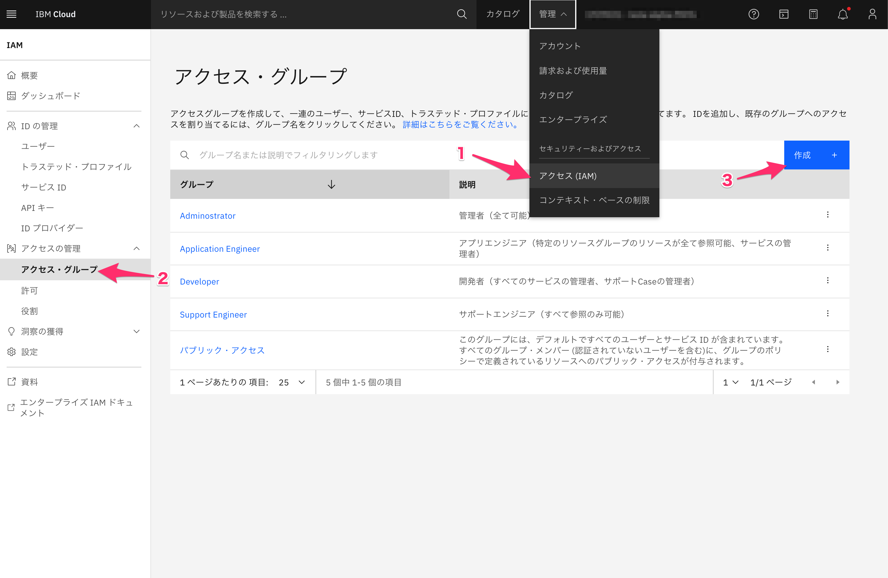

2. 「アクセス・グループの作成」ダイアログにて名前を入力し、作成をクリック
   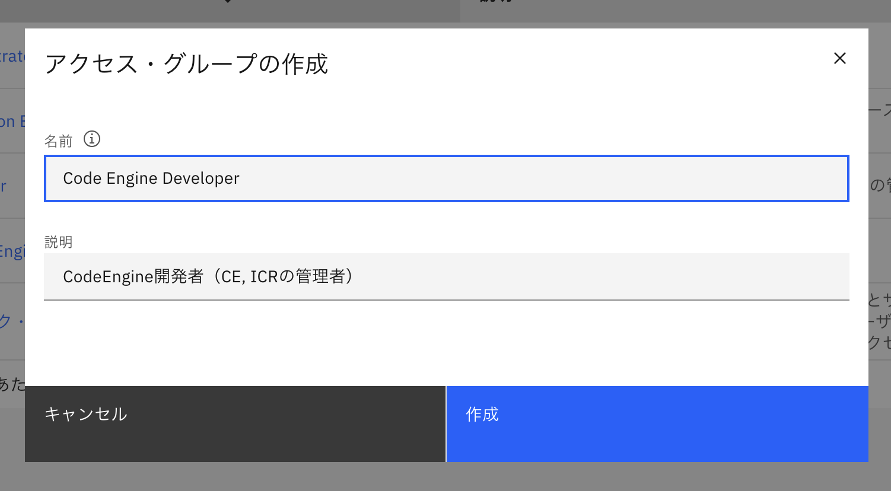

   入力例：

   * 名前： Code Engine Developer
   * 説明： CodeEngine開発者（CE, ICRの管理者）

3. 割り当てる権限を設定するために、アクセス > アクセス権限の割り当てをクリックします

   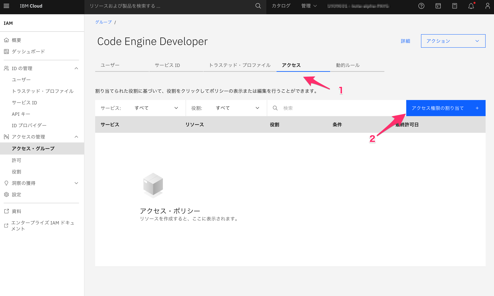

4. まずはCode Engineの権限を割り当てます

   * サービス：Code Engine

   * リソース：すべて
   * 役割とアクション
     * サービス・アクセス: 管理者, Compute Environment Administrator
     * プラットフォーム・アクセス: 管理者, Service Configuration Reader, Key Manager

   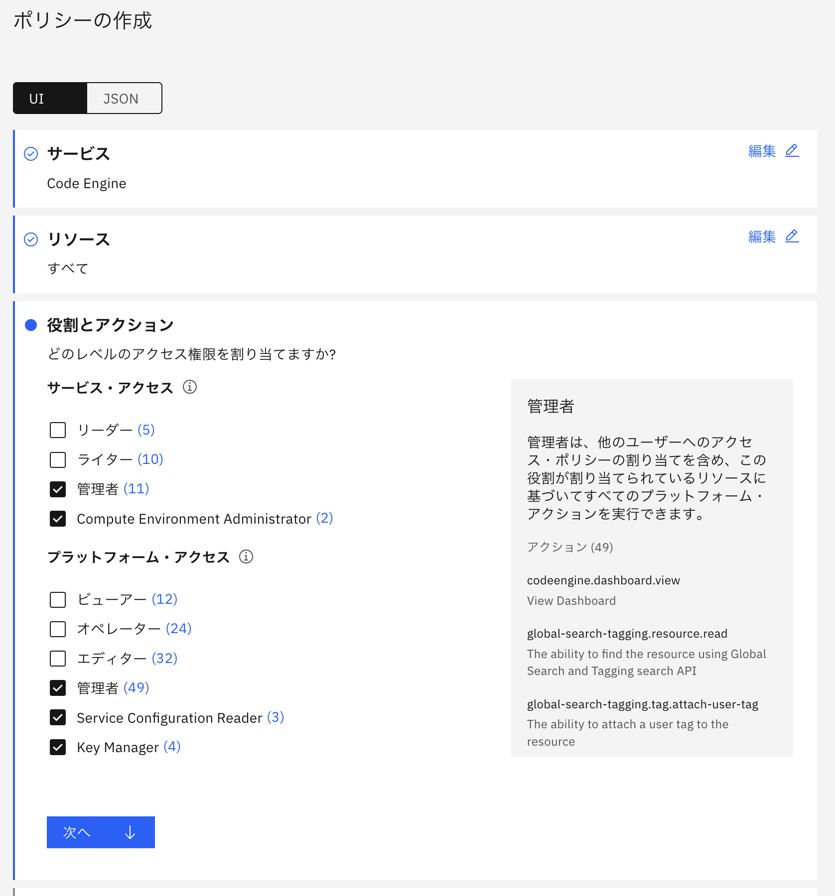

5. 「追加」をクリックし「アクセス・サマリー」に割り当てに追加します

   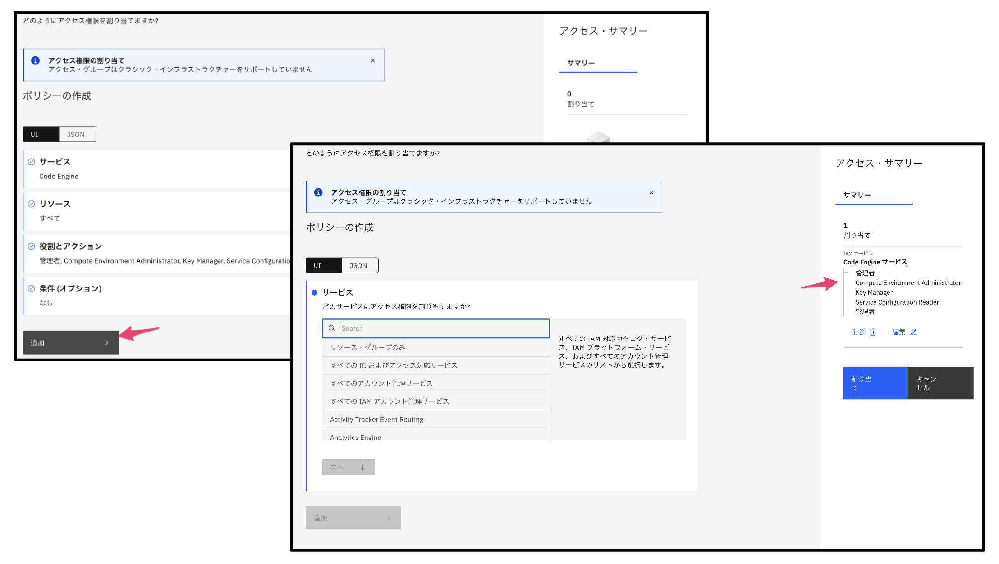

6. 同様の操作を以下の

   * IBM Cloud Container Registry

     * サービス：Container Registry

     * リソース：すべてのリソース

     * 役割とアクション
       * サービス・アクセス: 管理者
       * プラットフォーム・アクセス: 管理者, Service Configuration Reader, Key Manager

   * IAM Identity Service

     * サービス：Container Registry

     * リソース：すべてのリソース

     * 役割とアクション
       * サービス・アクセス: User API key creator (ユーザーAPIキーの作成者)
       * プラットフォーム・アクセス: なし

   * Resource Group
     * サービス：リソース・グループのみ
     * リソース：すべてのリソース or 特定のリソース
       * リソースグループ：ご利用されるリソースグループ（Default）
     * リソース・グループ・アクセス：ビューアー

7. 最後に割り当てをクリック

   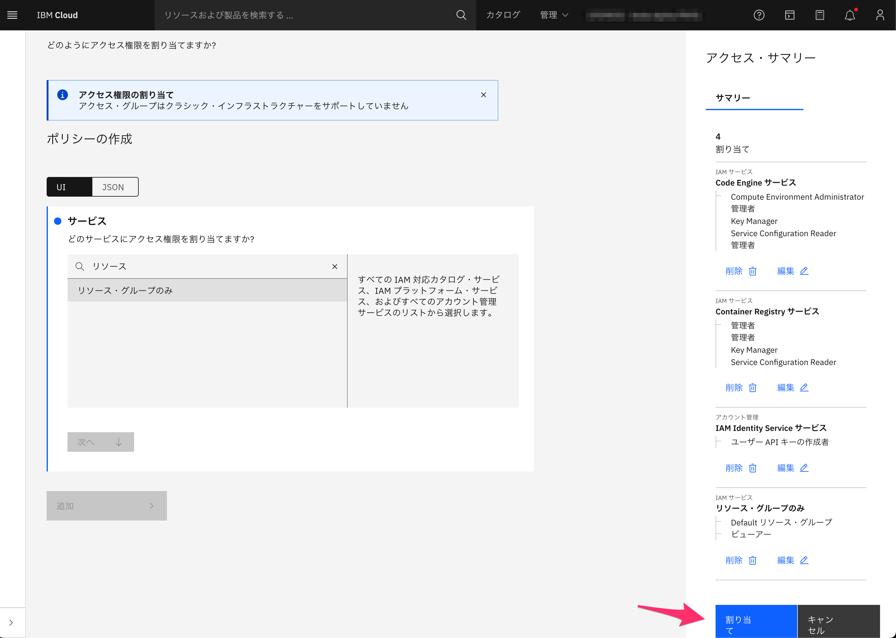

8. 以下のようにアクセス権限が割り当てられれば完了です

   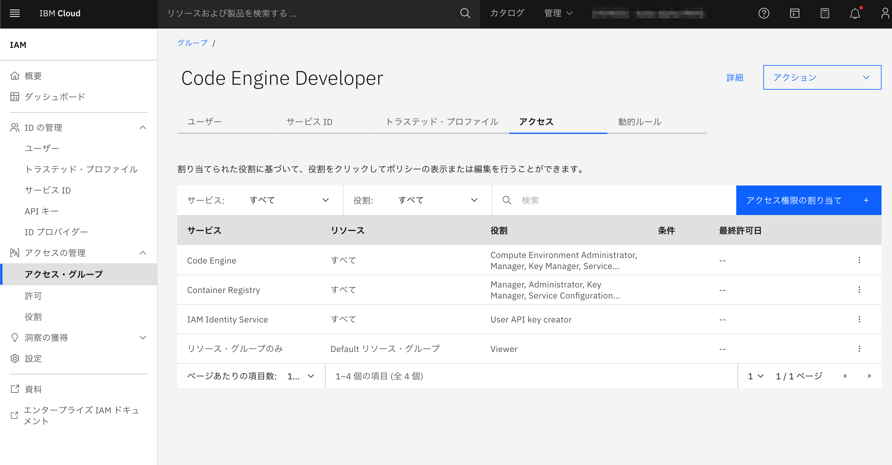

   

## メンバーの招待

1. 「管理 > アクセス(IAM) > ユーザー」から「ユーザーの招待」　をクリックします

   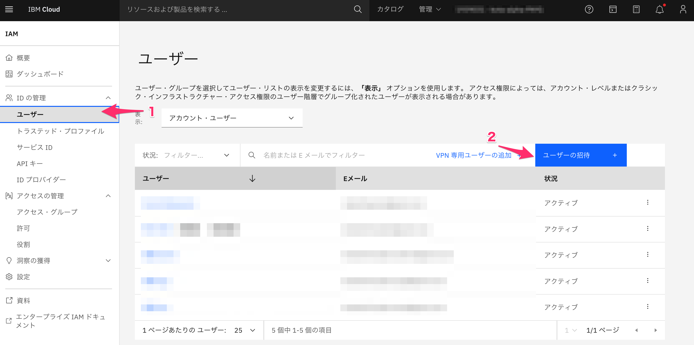

2. 「ユーザーの招待」の画面にて、招待するメンバーのメールアドレス、割り当てるアクセス・グループを選択し、追加し、最後に招待をクリックします

   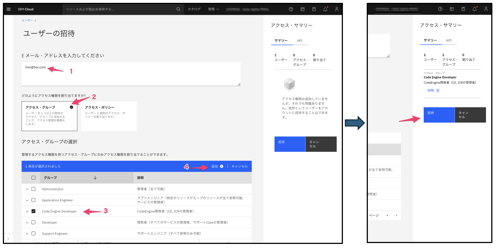

3. 招待クリック後、以下のようにユーザーリストに追加されれば完了です

   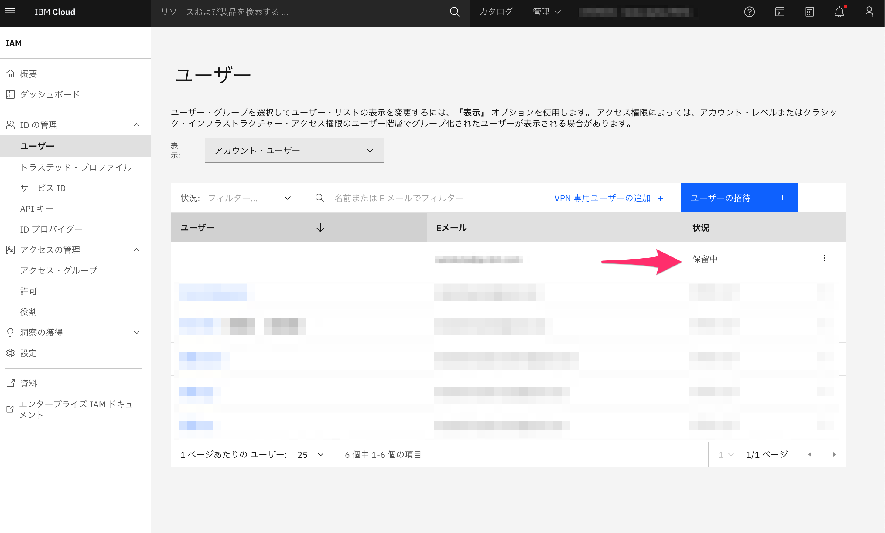

## [参加メンバー]アカウントへの招待の受け入れ

### すでにIBM Cloudをご利用されている方

1. IBM Cloudにログインします
2. ログイン後画面右上の通知より、「アカウント Action required: You are invited to join an account in IBM Cloud」から「Join now」をクリックし、IBM Cloudアカウントに参加します

	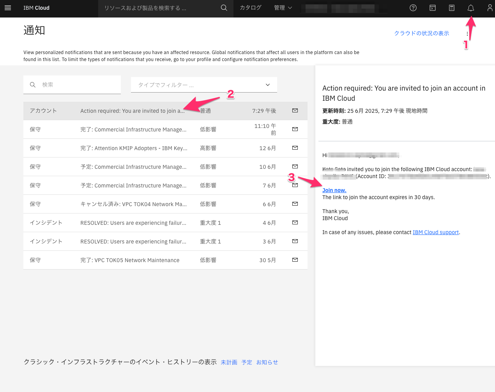

### 新たにIBM Cloudをご利用される方

1. 招待メールを確認し、IBM Cloudアカウントにご参加ください

   件　名：Action required: You are invited to join an account in IBM Cloud

   差出人：no-reply@cloud.ibm.com
   
   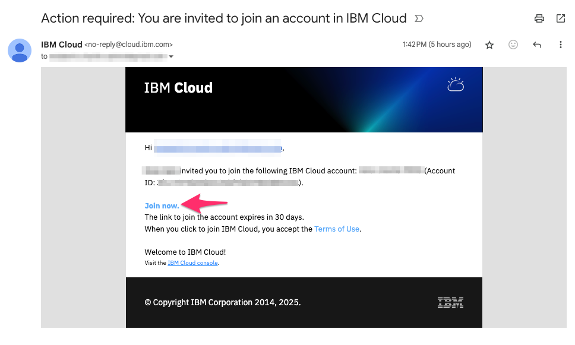

## 最後に

お疲れ様でした！これでハンズオンを実施するための準備が完了しました！

