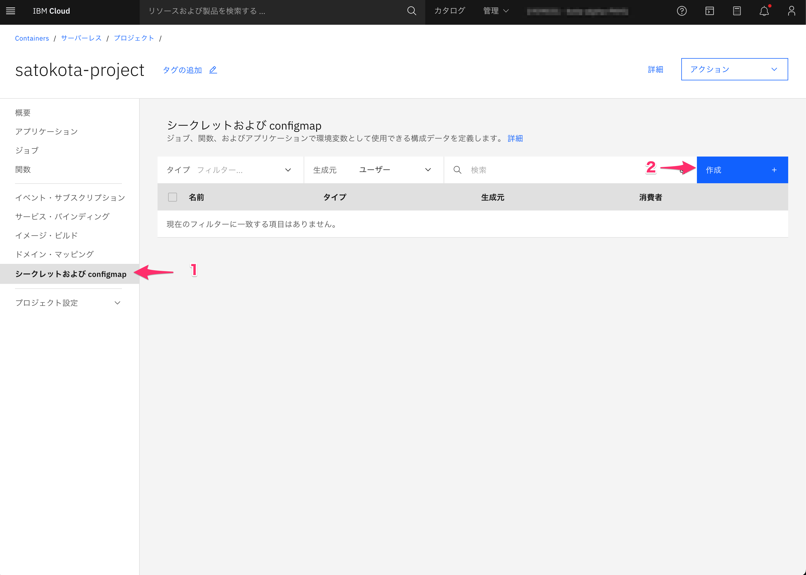
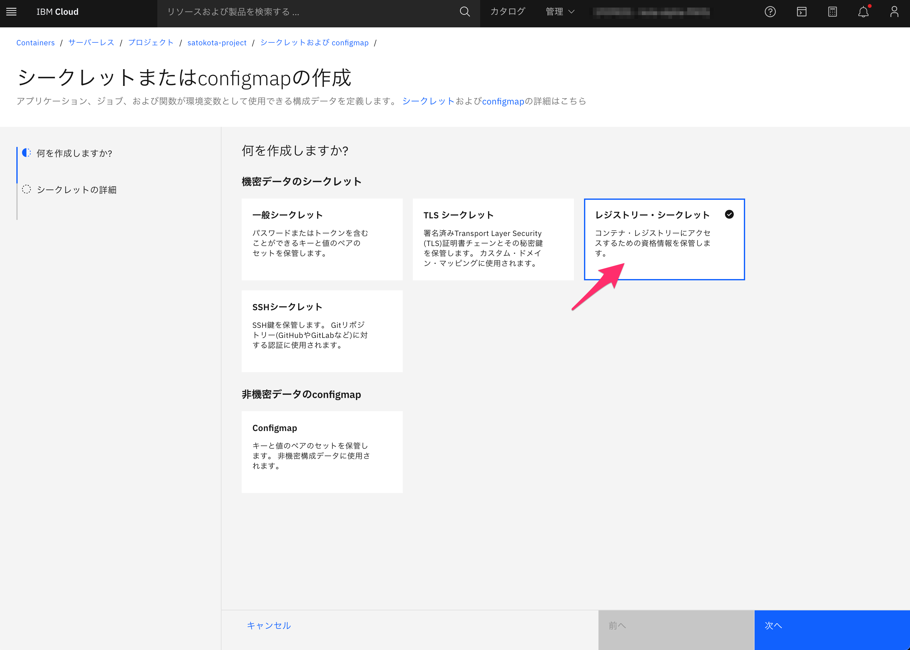
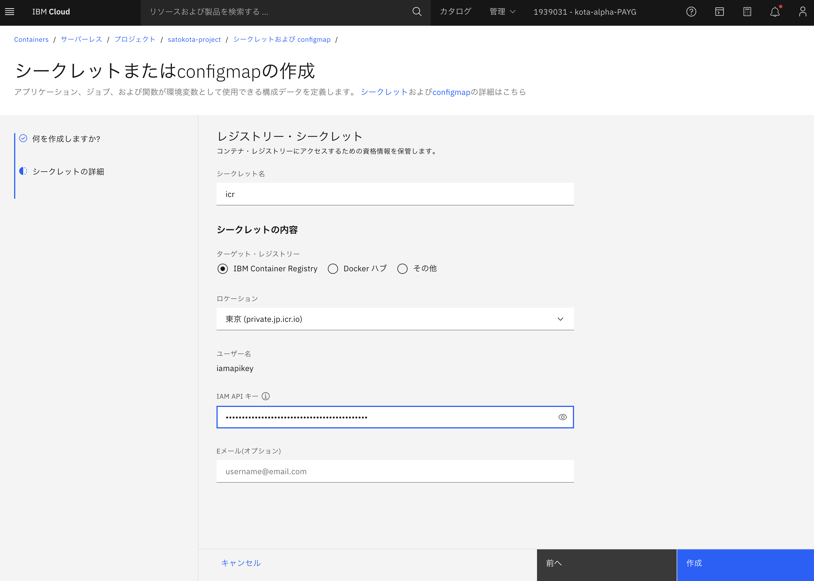
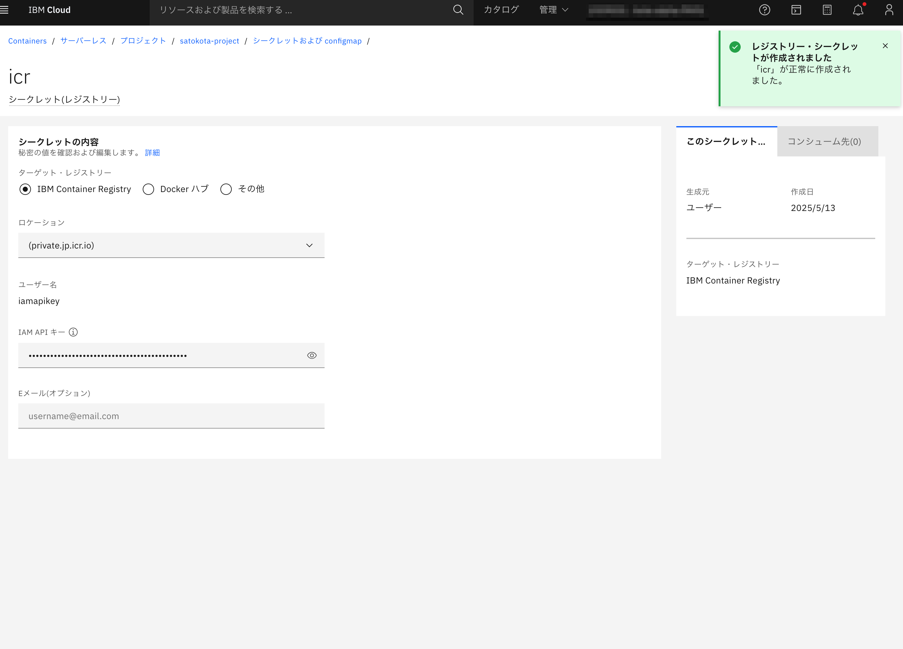

Lab1  Projectの作成

- [目的とゴール](#目的とゴール)
- [プロジェクトの作成](#プロジェクトの作成)
- [最後に](#最後に)

## 目的とゴール

Code Engineではまず最初にProjectを作成します。Projectを利用することで、アプリやJob、Secretなどをグルーピング化し、開発環境・本番環境であったり、Aプロジェクト、Bプロジェクトのように環境を分離し管理することが可能です。プロジェクト作成後は、プロジェクトで利用するContainer Registryの認証の設定をおこないます

ゴール

* Projectの作成が行える
* Registryとの連携が行える

## プロジェクトの作成
1. こちらの[URL](https://cloud.ibm.com/containers/serverless/projects)または、IBM Cloudの画面から、サーバーレス・プロジェクトにアクセスします

   

   

2. 作成ボタンをクリックします

   

   

3. プロジェクトの作成画面にて、作成する地域や名前を指定し、プロジェクトを作成します

   

   入力項目

   * ロケーション：Tokyoリージョン(jp-tok)

   * 名前：ご自身のお名前+project  (例:satokota-project)

   

4. プロジェクト一覧にて、作成したプロジェクトの状態が”作成中”から”アクティブ”に変わればOKです。
   一覧から作成したプロジェクトをクリックしプロジェクトの詳細画面に移動します

   

   

5. プロジェクトの画面が表示されました！次のLabにて、このプロジェクトにアプリをデプロイしていきます。
   現在は何もアプリを作成していないため、画面右のグラフは０インスタンスとなっていますが、この画面にてプロジェクトでのリソース使用量を俯瞰して確認できます

## レジストリとの連携

1. 続いて、このプロジェクトで利用するContainer Registryの認証を設定します。右のメニューから"シークレットおよびconfigmap"から、作成をクリックします
   

2. レジストリー・シークレットを選択します
   

3. 以下必要な内容を記載し作成をクリックします

   入力項目

   * シークレット名：ICR

   * ターゲット・レジストリー：IBM Container Registry

   * ロケーション：東京

   * IAM API キー：https://cloud.ibm.com/iam/apikeysにて発行したAPI-Keyを記載

     ※APIキーの発行方法

     * [APIキー](https://cloud.ibm.com/iam/apikeys)画面にて作成をクリック
       * 名前：例（codeengine-icr）
       * 漏洩対策：漏洩したキーを無効にする
       * セッションの作成：いいえ
     * 作成後にコピーをクリック
     * ※API-keyは作成直後の一度だけ確認が可能です。必要に応じてメモしてください

4. ”レジストリ・シークレットが作成されました”と表示されればOKです

   

## 最後に
お疲れ様でした！、次の[Lab 2](../Lab2)に進んでください

