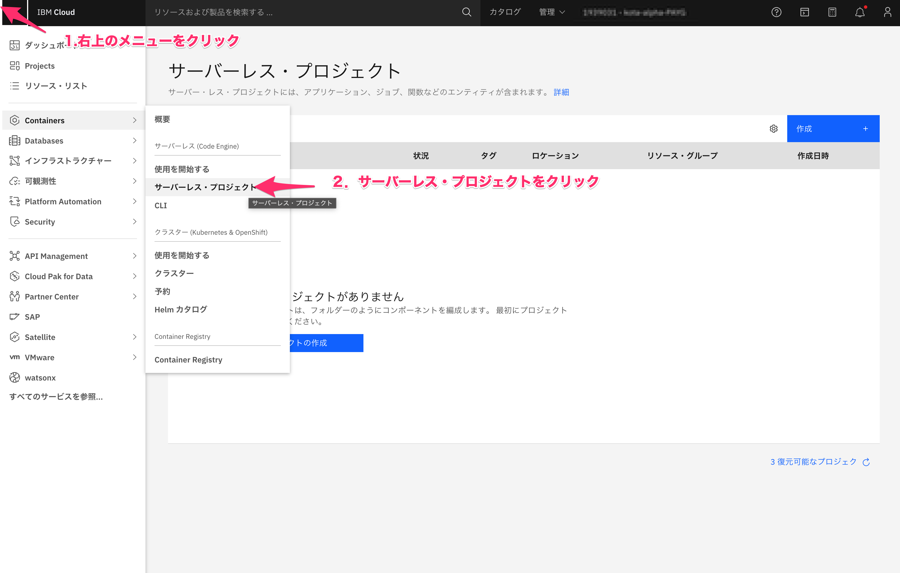
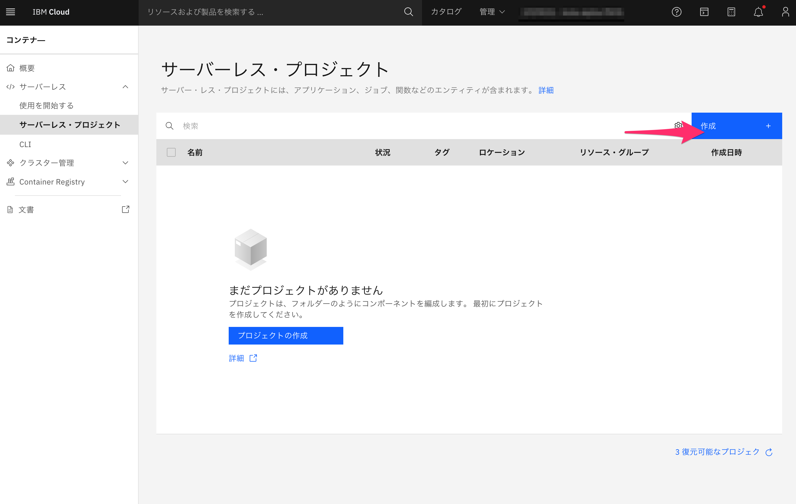
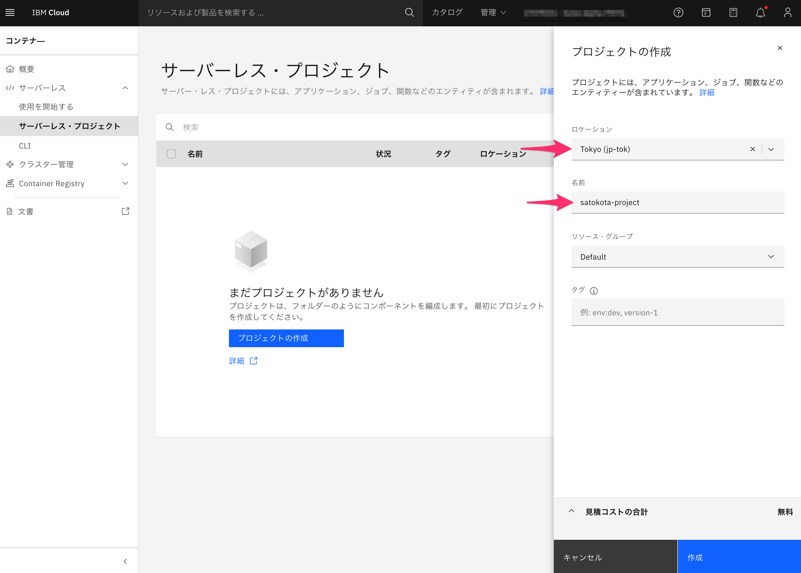
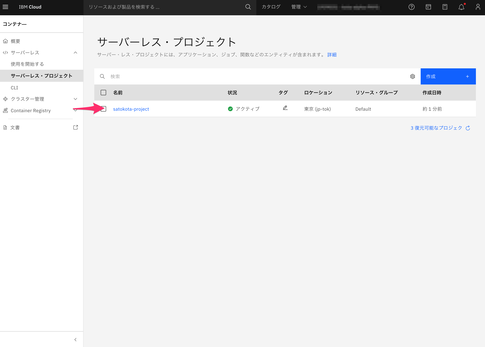
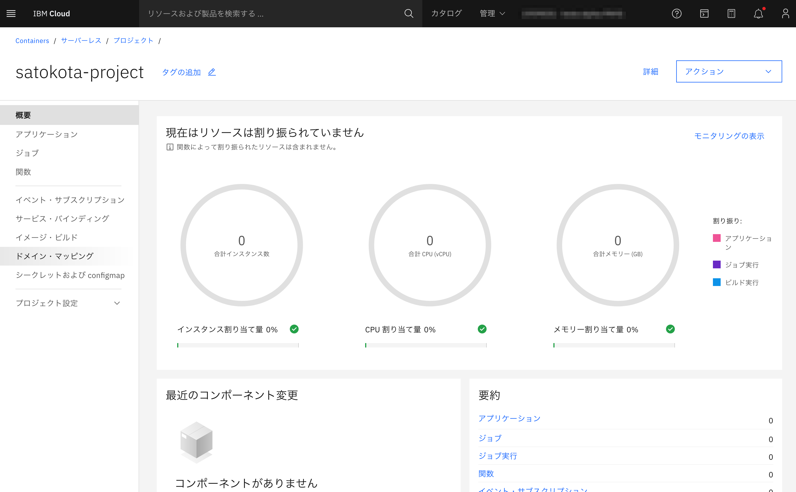

Lab1  Projectの作成

- [目的とゴール](#目的とゴール)
- [プロジェクトの作成](#プロジェクトの作成)
- [最後に](#最後に)

## 目的とゴール

Code Engineではまず最初にProjectを作成します。Projectを利用することで、アプリやJob、Secretなどをグルーピング化し、開発環境・本番環境であったり、Aプロジェクト、Bプロジェクトのように環境を分離し管理することが可能です

ゴール

* Projectの作成が行える
   

## プロジェクトの作成
1. こちらの[URL](https://cloud.ibm.com/codeengine/projects)または、IBM Cloudの画面から、Code Engineのプロジェクトにアクセスします

   

   

2. 作成ボタンをクリックします

   

   

3. プロジェクトの作成画面にて、作成する地域や名前を指定し、プロジェクトを作成します

   

   入力項目

   * ロケーション：Tokyoリージョン(jp-tok)

   * 名前：ご自身のお名前+project  (例:satokota-project)

   

4. プロジェクト一覧にて、作成したプロジェクトの状態が”作成中”から”アクティブ”に変わればOKです。
   一覧から作成したプロジェクトをクリックしプロジェクトの詳細画面に移動します

   

   

5. プロジェクトの画面が表示されました！次のLabにて、このプロジェクトにアプリをデプロイしていきます。
   現在は何もアプリを作成していないため、画面右のグラフは０インスタンスとなっていますが、この画面にてプロジェクトでのリソース使用量を俯瞰して確認できます

## 最後に
お疲れ様でした！、次の[Lab 2](../Lab2)に進んでください

