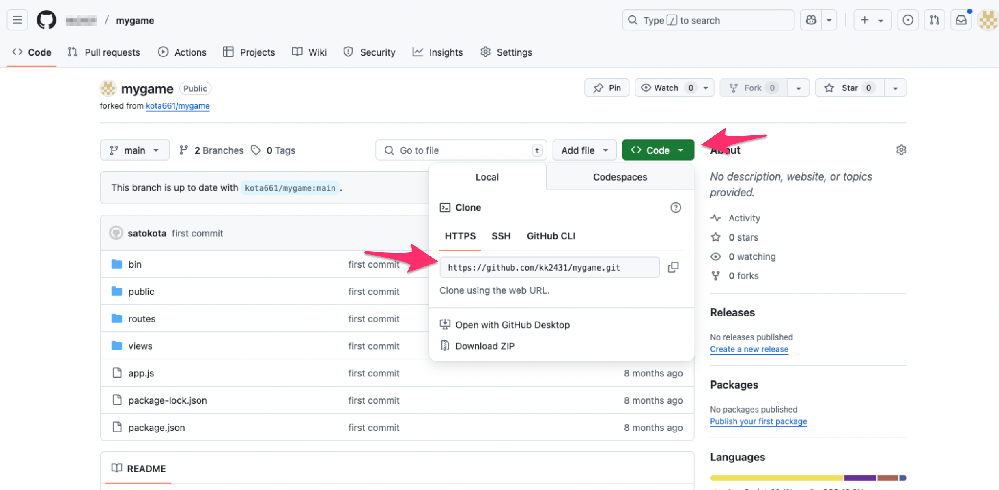

Lab4 CI/CDを利用したアプリのデプロイ

- [概要とゴール](#概要とゴール)
- [Labの流れ](#labの流れ)
- [Step 1 - サンプルコードをFork](#step-1---サンプルコードをfork)
- [Step 2 - CICD機能を利用してアプリをデプロイ](#step-2---cicd機能を利用してアプリをデプロイ)
- [Step 3 - 新しいバージョンへのバージョンアップ](#step-3---新しいバージョンへのバージョンアップ)
- [最後に](#最後に)

## 概要とゴール

このLabではCode EngineにはCICD機能を体験いただきます

ソースコードを元に、コンテナイメージをビルドしデプロイすることが可能です。そして、ビルド機能では、Dockerfileを用意することなく、ソースコードを自動的に分析し、プログラミング言語に合わせ自動的にコンテナ化することも可能です。

**ゴール**

* CICD機能を利用しGithubのソースコードからアプリのデプロイが行える
* CICD機能を利用して新しいバージョンのアプリにバージョンアップが行える

**利用するサンプルコード・アプリ**

* コード： https://github.com/kota661/mygame

* アプリ：昔なつかしのあのゲーム！

  

## Labの流れ

1. サンプルコードをFork
2. CICD機能を利用してアプリをデプロイ
3. 新しいバージョンへのバージョンアップ

## Step 1 - サンプルコードをFork

> Githubのアカウントをお持ちでない場合は、このステップをスキップし、Step２からスタートしてください。
>
> Step1をスキップした場合、Spte３は体験いただけません。

1. https://github.com/kota661/mygame にアクセスし、リポジトリをForkしてください
   パブリックリポジトリで作成してください

   

2. Create a new forkの画面にて、「Copy the main branch only」 のチェックを外し、「Create fork」をクリック

   

3. forkしたリポジトリのURLをこのあと利用するため、メモしてください

   

## Step 2 - CICD機能を利用してアプリをデプロイ

それではアプリを作成していきましょう！

1. まずはプロジェクトにアクセスし、アプリの作成をクリックします

   

   

2. アプリ作成画面にて、アプリ名とGitのURLを入力し、最後に「ビルド詳細の指定」をクリックします

   

   * 名前: application-{お名前}-mygame

   * コード・リポジトリー URL：https://github.com/{ご自身のアカウント}/mygame

     ※Step1をスキップした場合は、　https://github.com/kota661/mygame　を入力してください

   

3. 「ビルド詳細の指定」にて、コードのビルド方法と、ビルド後のコンテナイメージの保管先の設定を行います

   まず初めに、ソースコードへのアクセス設定です。今回はパブリックリポジトリで、ブランチはデフォルトのmainのため、特に指定なく「次へ」をクリックします

   

4. 次にビルド方法とビルド環境のリソース量を設定します

   

   * 戦略：　Dockerfileなしでビルド可能なCloud Native Buildpackを利用します

   * ビルド用のリソース：リソース量も少ないSサイズを指定

   

   > 補足情報
   >
   > Cloud Native Buildpacksは、アプリケーションのソースコードからコンテナイメージを自動的に作成するためのツールセットです。開発者はDockerfileを手動で作成する必要がなく、標準化されたビルド方法を利用してアプリをコンテナ化します。Dockerfileを個別に定義しないため、セキュリティパッチの適用も容易になります。

   

5. 最後にビルド後のコンテナイメージの保管場所の設定を行います

   

   コンテナレジストリには今回はIBM Cloud Container Registryを利用します

   * 名前空間：任意のものを選択
   * リポジトリ（イメージ名）：他のイメージと区別しやすいようにアプリ名と同じものを指定

   入力後「Done」をクリックします

   > **コンテナー・レジストリーの参照が見つかりませんでした** と表示される場合
   >
   > API-Keyを利用して、IBM Cloud Container Registryへのアクセスを追加する必要があります
   >
   > 1. 追加をクリック
   >
   > 2. レジストリー・シークレットの作成 ウィンドウにて以下入力
   >
   >    * シークレット名：ICR
   >
   >    * ターゲット・レジストリー：IBM Container Registry
   >
   >    * ロケーション：東京
   >
   >    * IAM API キー：https://cloud.ibm.com/iam/apikeysにて発行したAPI-Keyを記載
   >
   >      ※APIキーの発行方法
   >
   >      * [APIキー](https://cloud.ibm.com/iam/apikeys)画面にて作成をクリック
   >        * 名前：例（codeengine-icr）
   >        * 漏洩対策：漏洩したキーを無効にする
   >        * セッションの作成：いいえ
   >      * 作成後にコピーをクリック
   >      * ※API-keyは作成直後の一度だけ確認が可能です。必要に応じてメモしてください
   >
   > 3. 作成をクリック

   

6. ビルド詳細が設定できていることを確認し、最後にリソース量やインスタンス台数を設定し作成します

   

   * CPUおよびメモリー：最小を選択

   * インスタンスの最大数：１

     

7. アプリの作成をクリックすると自動的にビルド処理が開始されます

   

   

8. ビルドの状況は、プロジェクトのトップ画面（右上のプロジェクト名をクリック）から「イメージ・ビルド」にアクセスすることで確認できます

   

   

9. ビルド実行名をするとビルド中のログや、ビルド時間など確認可能です

   

   

10. ビルドが完了すれば、自動的にアプリがデプロイされます。ビルドが完了したことを確認し、アプリにアクセスしてみましょう

    

    一番上にhostnameとして、Containerの名前が表示されます

    スペースキーを入力することでゲームが楽しめます！

## Step 3 - 新しいバージョンへのバージョンアップ

アプリが無事にリリースできたので、次は新しいバージョンのリリースを行ってみましょう

新しいバージョンではゲームのLiveが１から３にアップし、より長くゲームが遊べます

1. 最初にGithubにて、Deveop ブランチの変更内容をmainにマージしてみましょう

   

   

2. Pull requestsの画面にて変更内容を確認し、Create pull requestをクリックします

   

   

3. Merge pull requestをクリック

   

4. MergedとなればOKです

   

5. それでは、ソースコードのマージが完了したので、Code Engineの画面にてビルド・デプロイしていきましょう！

   アプリケーションを選択し、「構成」＞「コード」＞「ビルドの再実行」の順にクリックします

   

6. 「ビルドおよびデプロイの実行」　をクリックします

   

   

7. 自動的にビルドが開始され、デプロイが完了するのを待ちます

   

8. ステータスが「対応可能」と変わったことを確認しアプリにアクセスしてみましょう！

   Liveが３つに！そして、背景の色が変わっていればバージョンアップ成功です

   ※ライフの数が変わらない場合はキャッシュされている可能性があるのでキャッシュクリアの上アクセスしてみてください

   

以上でこのLabは終了です。

## 最後に
お疲れ様でした！
